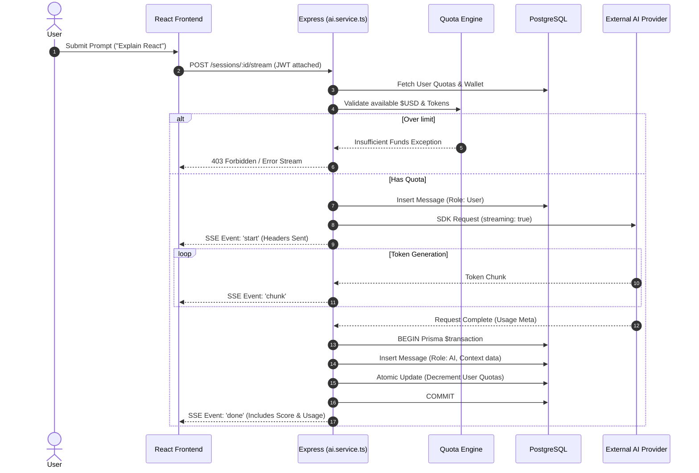
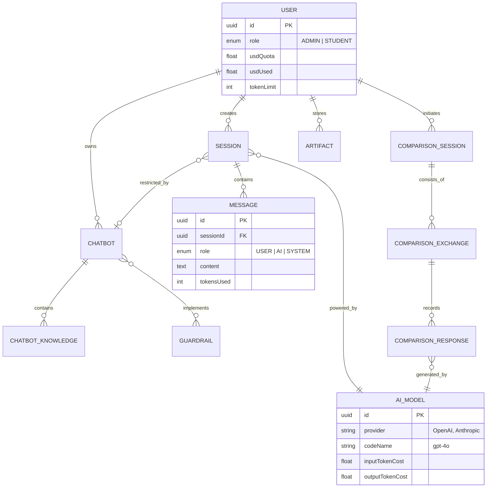
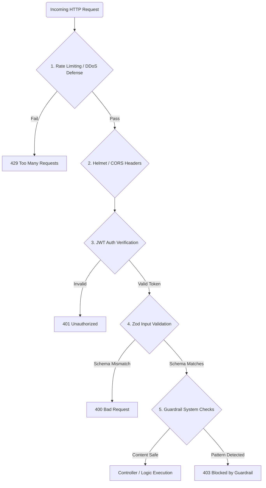

# Architecture & System Design

This document provides a highly detailed technical breakdown of the **GenAI Lab** platform. It outlines the topological structure, component responsibilities, request lifecycles, and database relationships using Mermaid.js diagrams.

---

## 1. High-Level System Architecture

The overarching system operates on a modern, decoupled client-server architecture consisting of a React-based SPA (Single Page Application) frontend and an Express/Node.js stateful backend. 

```mermaid
graph TD
    %% Define Nodes
    Client["💻 Client Browser<br/>(React / Vite + Tailwind)"]
    Gateway["🚀 API Gateway & Logic<br/>(Express / Node.js)"]
    DB[("🗄️ Primary Database<br/>(PostgreSQL)")]
    
    subgraph "External AI Providers"
        OpenAI("OpenAI API<br/>(GPT-4o)")
        Anthropic("Anthropic API<br/>(Claude 3.5)")
        Google("Google API<br/>(Gemini Flash)")
    end

    subgraph "Internal Core Services"
        Auth["Auth & JWT Service"]
        Budget["Billing & Quota Engine"]
        Scoring["Prompt Scoring Engine"]
        Guardrails["Guardrails & Safety Engine"]
    end

    %% Connections
    Client -->|REST API / JSON| Gateway
    Client -->|Server-Sent Events (SSE)| Gateway

    Gateway -.-> Auth
    Gateway -.-> Budget
    Gateway -.-> Scoring
    Gateway -.-> Guardrails
    
    Gateway -->|Prisma ORM| DB
    
    Gateway -->|Provider SDKs| OpenAI
    Gateway -->|Provider SDKs| Anthropic
    Gateway -->|Provider SDKs| Google

    classDef frontend fill:#3b82f6,stroke:#1e40af,color:white;
    classDef backend fill:#10b981,stroke:#047857,color:white;
    classDef db fill:#f59e0b,stroke:#047857,color:white;
    classDef external fill:#6366f1,stroke:#4338ca,color:white;

    class Client frontend;
    class Gateway,Auth,Budget,Scoring,Guardrails backend;
    class DB db;
    class OpenAI,Anthropic,Google external;
```

### Component Breakdown
*   **Client Interface:** Handles state using TanStack Query to minimize redundant network calls. The UI is built using Shadcn primitives, ensuring a modular and accessible design system. SSE (Server-Sent Events) listeners are embedded directly in chat components for type-writer style token rendering.
*   **Express Gateway:** The central brain resolving routing. Relies heavily on middleware chains (Zod validation -> Rate Limiter -> JWT Auth -> Controller).
*   **Internal Core Services:** Separated into independent files (`auth.service.ts`, `scoring.service.ts`, etc.) adhering to the Dependency Injection and Service-Oriented-Architecture principles.

---

## 2. Request Lifecycle: AI Streaming & Billing

The most critical flow in GenAI Lab is executing an AI prompt, returning it asynchronously to the user without timeout errors, and guaranteeing atomic token billing.



### Key Mechanisms:
1.  **SSE Lifecycle:** By utilizing `text/event-stream`, the Node thread does not block heavily. Memory overhead per connection is kept minimal.
2.  **Concurrency Safety:** Token updates rely on PostgreSQL row locking and Prisma `$transaction`s. If two tabs submit a prompt simultaneously to drain the last `0.01` USD, the first thread to commit forces the second thread to encounter a dirty read, successfully rejecting the second prompt and preventing negative balance bleeding.

---

## 3. Database Entity Relationship Diagram (ERD)

The relational schema heavily enforces normalized constraints to preserve analytical accuracy for the administrators.



### Schema Highlights:
*   **Virtual Wallets:** The `User` table acts as a pseudo-ledger. `usdQuota` vs `usdUsed`.
*   **Model Agnosticism:** Chatbots, Standard Sessions, and Comparison Exchanges all map back to a unified `AI_MODEL` reference, allowing the platform to swap models globally without breaking historic chat logs.

---

## 4. Multi-Model Comparison Execution Flow

To achieve synchronous benchmarking without degrading performance, the backend uses `Promise.allSettled()` connected to independent Service Workers.

```mermaid
graph LR
    Req[POST /start-exchange<br/>(2 to 6 Models)]
    
    subgraph Parallel Dispatch Engine
        Worker1[Task: Model A (GPT-4)]
        Worker2[Task: Model B (Claude)]
        Worker3[Task: Model C (Gemini)]
    end
    
    Req --> Worker1
    Req --> Worker2
    Req --> Worker3

    subgraph Error Handling & Aggregation
        Worker1 --> |Success + Timing| Reducer
        Worker2 --> |Failure / Timeout| Reducer
        Worker3 --> |Success + Timing| Reducer
    end
    
    Reducer --> BatchInsert[(DB: Bulk Insert <br/> Comparison Responses)]
```

### Explanation:
When a user launches a comparison request (e.g., testing "GPT-4" vs "Claude 3.5"), the request hits the `comparison.service.ts` controller. 
1. The backend builds a map of active SDK connections.
2. It orchestrates concurrent outbound HTTP requests to all requested providers.
3. If one model times out or rate-limits, it fails gracefully (`Promise.allSettled`) rather than collapsing the entire exchange.
4. Latency (`startTime` vs `endTime`) is recorded natively on the server to prevent client-side network latency (like slow WiFi) from skewing the model benchmarking metrics.

---

## 5. Security & Gatekeeping Layers (Middleware)

Every secured route passes through a rigorous set of verification layers before touching the core logic.



### Guardrails Mechanism (`guardrail.service.ts`):
*   Acts as a semantic and regex layer.
*   Prior to dispatching a user prompt to an LLM, the text is scanned against Administrator-defined blocklists (e.g., stopping users from passing "ignore all previous instructions"). 
*   If matched, the request is intercepted entirely, sparing token costs and returning a customized educational warning to the user.